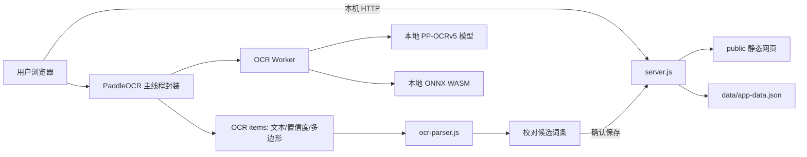

# 拾词 · 本地英语背单词学习工具交接文档

> 本文档用于把项目完整交接给新的对话、Agent 或开发者。接手者应先通读“当前状态”“不可破坏的边界”“OCR 踩坑记录”和“验证口径”，再修改代码。
>
> 这是一份活文档。后续出现重要设计调整、验证结果或新坑点时，请继续更新本文，而不是另建互相矛盾的交接说明。

## 1. 一句话结论

项目已经是一个可以在 Windows 上真实运行的本地英语背单词工具，照片 OCR 已从 Tesseract.js 完整替换为离线 PaddleOCR.js PP-OCRv5。第一张横置、中英混排教材原始照片已在真实浏览器中正确识别出 11 组；另外两张照片的同像素无损 PNG 副本已在浏览器中分别正确识别出 10 组和 7 组。横置照片会自动物理转正后复识别，多列表格会排除音标、词性、表头和页脚，词首教材星号会在导入前安全移除。词库、拼写、错词循环、复习、发音和备份相关自动测试均通过。

Windows 已完成真实启动和浏览器 OCR 验收。Mac 启动脚本和网页代码已经准备好，但尚未在真实 Mac 设备上验收。

## 2. 项目位置与用途

工作区根目录：

```text
D:\CodeX\family work\HuyiTing Project\英语背单词学习工具
```

目标用户是初中阶段的女孩及其家长。产品不是面向开发者的后台系统，而是需要简单、稳定、低操作成本的家庭学习工具。

核心目标：

1. 用教材照片快速建立本地单词库。
2. 用认读卡片和拼写练习帮助逐个掌握词组。
3. 第一次拼错的内容进入强化循环，需要随后连续答对两次。
4. 按 1、3、7、14、30 天节奏复习。
5. 使用操作系统和浏览器自带英文语音朗读。
6. 照片、词库和学习记录只在本机处理和保存。
7. Windows 和 Mac 共用同一套网页代码及数据格式。

## 3. 用户已经确认的产品决策

- 交付形式是“本地网页 + Node.js 小型本地服务器”，不是云网站。
- Windows 直接使用 `start-windows.bat`，不需要再改成其他桌面格式。
- Mac 使用 `start.command`，仍需目标设备实测。
- OCR 默认全自动；正常照片不要求用户先裁剪或手工旋转。
- 横置照片优先准确率：首轮判断方向后自动物理转正并复识别一次；只有最佳结果仍少于两组或中英配对率低于 70% 时，才显示旋转重试界面。
- 照片不上传、不写入数据目录，完成识别后释放引用；只有失败等待重试时暂时保留当前照片对象。
- 词库允许相同英文重复导入，每条记录独立学习。
- 服务器词库接口、学习记录和启动方式在 OCR 替换过程中保持兼容。

## 4. 当前功能状态

| 功能 | 当前状态 | 说明 |
|---|---|---|
| Windows 启动 | 已实现并实测 | 双击 `start-windows.bat` |
| Mac 启动 | 已实现，未实机验证 | 需要 Node.js 22+，首次可能需 `chmod +x start.command` |
| 照片上传 | 已实现 | JPG、JPEG、PNG，多图选择 |
| 离线 OCR | 已实现并真实验收 | PaddleOCR.js 0.4.2、PP-OCRv5 mobile |
| 自动方向判断 | 已实现 | 首轮尝试四方向坐标；横置照片自动物理转正并追加一轮 OCR |
| 中英表格配对 | 已实现 | 自动选择英文列和中文释义列，单调动态配对并排除音标、词性等列 |
| OCR 噪声过滤 | 已实现 | 排除页眉、序号、说明文字、低置信度碎片和无配对页边内容 |
| OCR 校对 | 已实现 | 可编辑、删除、添加，显示置信度状态 |
| 失败旋转重试 | 已实现 | 左转、右转、重新识别，仅失败时出现 |
| 手工录入 | 已实现 | 每行一组，支持制表符或中英文冒号分隔 |
| 词库管理 | 已实现 | 搜索、状态筛选、编辑、重学、删除 |
| 新词认读 | 已实现 | 卡片展示英文、中文、自动发音 |
| 拼写练习 | 已实现 | 听发音、看中文、输入英文 |
| 错词强化循环 | 已实现 | 拼错后稍后再出现，并要求连续答对两次 |
| 间隔复习 | 已实现 | 1、3、7、14、30 天 |
| 发音 | 已实现 | Web Speech API，优先英文系统语音 |
| 备份与恢复 | 已实现 | JSON 导出、恢复前自动备份旧数据 |
| 安全退出 | 已实现 | 网页按钮停止本地服务 |

## 5. 当前目录结构

```text
英语背单词学习工具/
├─ HANDOFF.md                       # 本交接文档
├─ README.md                        # 面向普通使用者的简要说明
├─ package.json                     # 开发构建与测试命令
├─ package-lock.json                # 固定依赖版本
├─ server.js                        # 本地服务器、API、静态文件、数据持久化
├─ start-windows.bat                # Windows 启动入口
├─ start.command                    # macOS 启动入口
├─ vite.config.js                   # OCR 浏览器包构建配置
├─ data/
│  ├─ app-data.json                 # 用户真实词库与学习记录，禁止随意覆盖或删除
│  └─ backups/                      # 恢复操作生成的旧数据备份
├─ public/
│  ├─ index.html                    # 页面结构
│  ├─ styles.css                    # 全站样式
│  ├─ app.js                        # 页面交互、学习流程、OCR 调用
│  ├─ ocr-parser.js                 # OCR 过滤、方向判断、中英配对
│  └─ vendor/paddleocr/
│     ├─ runtime/
│     │  ├─ paddle-ocr.js           # Vite 生成的浏览器运行包
│     │  └─ ocr-worker.js           # 独立 OCR Worker
│     ├─ models/
│     │  ├─ PP-OCRv5_mobile_det_onnx_infer.tar
│     │  └─ PP-OCRv5_mobile_rec_onnx_infer.tar
│     └─ wasm/                      # ONNX Runtime WASM/MJS 全部兼容变体
├─ src/
│  └─ ocr-runtime.js                # PaddleOCR 初始化及预测封装源文件
├─ scripts/
│  └─ copy-ocr-assets.js            # 构建后复制 Worker/WASM 并检查模型
├─ tests/
│  ├─ server.test.js                # API、学习、备份及离线资源测试
│  ├─ ocr-parser.test.js            # 四方向、缺失释义、多列表格测试
│  └─ fixtures/
│     ├─ expected-ocr.json          # 固定 11 组 OCR 基准
│     ├─ expected-ocr-e7bd80.json   # 固定 10 组多列表格基准
│     └─ expected-ocr-ad34e2.json   # 固定 7 组带星号词表基准
└─ 样例/
   ├─ 4f214b0444e10cfc45bad2c5fbf92f42.jpg  # 11 组关键 OCR 回归照片
   ├─ e7bd80ecd5782849cf6e21bd5df2874d.jpg  # 10 组横置多列表格照片
   └─ ad34e2f37e4c99acdc2c8670b4231bb6.jpg  # 7 组带星号词表照片
```

说明：项目根目录目前故意没有 `node_modules`。普通使用不需要它；只有重新构建 OCR 运行包时才安装开发依赖。

## 6. 启动、测试与重新构建

### 6.1 普通使用

Windows：

```text
双击 start-windows.bat
```

Mac：

```text
第一次：chmod +x start.command
以后：双击 start.command
```

要求安装 Node.js 22 或更高版本。当前 Windows 开发机验证时使用的是 Node.js 24 系列。

服务器默认从 `4173` 端口开始。如果端口被占用，会继续尝试后续端口。也可临时指定：

```powershell
$env:PORT='43174'
node server.js
```

### 6.2 自动测试

不需要安装依赖即可执行：

```powershell
npm.cmd test
```

也可直接执行：

```powershell
node --test tests/*.test.js
```

注意：Windows PowerShell 的执行策略可能阻止 `npm.ps1`，此时使用 `npm.cmd`，不要误判为 npm 未安装。

重要数据提醒：`tests/server.test.js` 会暂时替换 `data/app-data.json`，结束后恢复原文件。不要在家长或孩子正在使用工具时运行测试，也不要让另一个服务进程同时写这个数据文件。更理想的后续改进是让测试使用独立临时数据文件。

### 6.3 重新构建 OCR 浏览器包

只有修改了 `src/ocr-runtime.js`、PaddleOCR 版本或构建配置时才需要：

```powershell
npm.cmd install --include=dev
npm.cmd run build
npm.cmd test
```

构建完成后，普通运行不再依赖 `node_modules`。确认测试通过后可以删除 `node_modules`，但不要删除 `public/vendor/paddleocr`。

两个模型文件不是构建脚本下载的；`scripts/copy-ocr-assets.js` 只检查它们是否存在。若模型缺失，构建会明确失败。模型必须继续保留在：

```text
public/vendor/paddleocr/models/
```

## 7. 整体架构



这里不能直接双击 `index.html` 使用。PaddleOCR 需要通过 HTTP 读取模型和 WASM，同时数据 API 也由 `server.js` 提供，所以必须用启动脚本启动本地服务。

## 8. 数据与 API

### 8.1 数据文件

真实数据位于：

```text
data/app-data.json
```

基本结构：

```json
{
  "version": 1,
  "words": [],
  "reviews": [],
  "settings": {
    "dailyNewLimit": 10
  }
}
```

单词记录包含：

- `id`
- `spelling`
- `meaning`
- `status`：`new`、`learning`、`review`、`mastered`
- `reviewStep`
- `nextDueDate`
- `failureCount`
- `createdAt`
- `updatedAt`

复习记录包含会话、答案、是否正确、复习时间及阶段变化等信息。

### 8.2 API

| 方法 | 路径 | 用途 |
|---|---|---|
| GET | `/api/state` | 获取词库、复习记录、设置和日期信息 |
| POST | `/api/words/import` | 批量导入校对后的词条 |
| PUT | `/api/words/:id` | 修改英文和中文释义 |
| DELETE | `/api/words/:id` | 删除词条及相关学习记录 |
| POST | `/api/words/:id?action=reset` | 把词条恢复为未学习状态 |
| POST | `/api/attempts` | 保存一次拼写结果并推进复习阶段 |
| GET | `/api/backup` | 导出 JSON 备份 |
| POST | `/api/restore` | 恢复备份 |
| POST | `/api/shutdown` | 安全停止本地服务 |

服务器保存数据时使用临时文件后原子替换，降低写入中断造成文件损坏的风险。

## 9. 学习与复习逻辑

首页把任务分为：

- 到期复习：`learning`，或 `review` 且 `nextDueDate` 已到。
- 今日新词：从 `new` 状态中最多取 `dailyNewLimit` 个，默认 10 个。

新词先进入认读卡片，然后进入拼写阶段。

拼写规则：

- 没有拼错过：答对一次即可完成本轮。
- 拼错：记录错误、稍后重新排入队列。
- 拼错后的同一词必须连续答对两次才完成本轮。
- 错误会把服务端词条状态设为 `learning`，复习阶段重置。
- 完成本轮后进入 1、3、7、14、30 天复习节奏。
- 完成最后一个阶段后状态变为 `mastered`。

不要只改前端队列而不改 `/api/attempts`，否则页面表现和持久化状态会不一致。

## 10. OCR 当前实现

### 10.1 固定版本和资源

- `@paddleocr/paddleocr-js`: `0.4.2`
- Vite: `8.1.4`
- 检测模型：PP-OCRv5 mobile detection，约 4.84 MB
- 中英文识别模型：PP-OCRv5 mobile recognition，约 16.70 MB
- 浏览器主运行包：约 25.70 MB
- 独立 OCR Worker：约 11.34 MB
- OCR 本地资源总计约 138 MB

运行模式：

- Worker 模式
- WASM 后端
- SIMD
- 两个线程
- 检测批次 1
- 识别批次 8

### 10.2 离线保证

所有模型、Worker、OpenCV 相关代码和 ONNX WASM 都位于项目中。

`server.js` 对静态页面设置了 Content Security Policy，其中：

```text
connect-src 'self'
```

这会阻止网页运行时访问非本机网络。真实浏览器在该限制下仍完成了样例识别，因此不是“资源看似在本地、实际仍偷偷访问 CDN”。

### 10.3 OCR 数据流

1. `public/app.js` 接收浏览器 `File`。
2. 正常识别直接把原始彩色图片交给 PaddleOCR，不再做统一灰度和强对比度预处理。
3. `src/ocr-runtime.js` 初始化 Worker 和本地模型，返回 PaddleOCR `items`。
4. 每个 item 包含：`text`、`score`、`poly`。
5. `public/ocr-parser.js` 分别按四个方向转换坐标，并按横坐标选择英文列和中文释义列。
6. 筛选英文词组和中文释义候选，排除音标、词性、表头和页脚。
7. 根据配对数量、缺失数量、行距、顺序和置信度选择最佳方向。
8. 若最佳方向不是 0°，网页把原图物理转正，再运行一次 OCR；两轮只保留质量更好的结果。
9. 输出 `ImportCandidate[]` 给校对表。

### 10.4 英文与中文过滤规则

英文候选：

- 最低置信度 0.8。
- 至少两个小写字母。
- 只允许英文字母、空格、句点、连字符、逗号和撇号等词组字符。
- 小写字母占非空格字符比例至少 45%。

中文候选：

- 最低置信度 0.85。
- 至少一个汉字，最低置信度仍为 0.85。
- 排除“序号”“英文”“音标”“词性”“中文释义”“单词板块”“词组板块”和“粗体词……”等页眉页脚。

高置信度英文在表格有效范围内找不到中文时会保留，中文留空并标记 `missing`。服务器现有非空校验会阻止缺少释义的词条直接保存。

### 10.5 方向评分和配对

首轮 OCR 后，解析器对坐标尝试：

```text
0°、90°、180°、270°
```

每个方向综合考虑：

- 成功配对数量。
- 配对率。
- 平均置信度。
- 英文栏是否位于中文栏左侧。
- 同行距离。

中英行不能使用简单的“每个英文找最近中文”贪心算法。当前先按横坐标聚类，比较各英文列和中文列组合，再使用保持行顺序的动态配对：优先最大化配对数量，再最小化总距离。这样既能避免某一行文字框中心偏移后整体错位，也能处理“序号、英文、音标、词性、中文释义”多列表格。

中文释义允许一个高置信度汉字，例如 `板`；最低置信度仍为 0.85，因此不会仅靠放宽字数规则接纳低置信度误字。词性缩写如 `adj.`、`n.`、`v.` 会在英文候选阶段排除。

### 10.6 校对状态

- `clear` → 清晰
- `check` → 建议检查
- `missing` → 缺少释义
- `manual` → 手工录入

综合置信度取英文和中文置信度中的较低值。达到 0.92 显示“清晰”，否则显示“建议检查”。

### 10.7 旋转重试

首轮判断为横置时会先自动物理转正并复识别一次，最多追加一轮。两轮按成功配对数、缺失数、未配对中文数、待检查数、配对率和平均置信度选择最佳结果。最佳结果满足以下任一条件时才显示重试区：

- 成功匹配少于两组。
- 配对率低于 70%。

用户点击旋转后，重试时才真正把图片绘制到旋转后的 Canvas 并重新运行 OCR。

## 11. 固定 OCR 回归样例

关键原图：

```text
样例/4f214b0444e10cfc45bad2c5fbf92f42.jpg
```

特点：

- 图片横置。
- 原图没有可靠方向信息。
- 中英文混排。
- 整页表格带阴影和页面边缘内容。
- 下方还有练习说明和另一页局部内容。

固定期望结果位于：

```text
tests/fixtures/expected-ocr.json
```

完整 11 组为：

1. `test a talk light` / `测试一盏谈话灯`
2. `try windsurfing` / `尝试帆板运动`
3. `take up roof gardening` / `从事屋顶园艺`
4. `act in a play` / `在戏剧中扮演角色`
5. `go rock climbing` / `去攀岩`
6. `make fruit animals` / `制作水果动物`
7. `climb up the rock wall` / `爬上岩壁`
8. `form a new word` / `创造一个新词`
9. `in this way` / `用这种方式`
10. `share with sb. about sth.` / `和某人分享某事（物）`
11. `discover something new` / `发现新事物`

页眉、序号、下方练习说明和右侧页面内容不得进入候选表。

第二张多列回归原图：

```text
样例/e7bd80ecd5782849cf6e21bd5df2874d.jpg
```

固定期望结果位于 `tests/fixtures/expected-ocr-e7bd80.json`，共 10 组：`curious`、`magazine`、`test`、`windsurf`、`feeling`、`brave`、`challenge`、`machine`、`traffic`、`board` 及其对应中文释义。验收要求 `machine / 机器`、`traffic / 交通`、`board / 板` 正确，不得混入音标、词性、表头或页脚。

第三张带星号词表原图：

```text
样例/ad34e2f37e4c99acdc2c8670b4231bb6.jpg
```

固定期望结果位于 `tests/fixtures/expected-ocr-ad34e2.json`，共 7 组：`print`、`printing`、`improve`、`camp`、`grow`、`fully`、`clarification` 及其对应中文释义。教材中的 `*fully`、`*clarification` 必须清洗为不带星号的英文后再导入，星号不得进入词库。

## 12. 开发全过程

### 阶段一：确定产品形态

最初需求是本地 HTML 学习工具，包含照片建词库、卡片背诵、错词反复记忆和发音。

为了同时支持 Windows 和 Mac，采用了：

- 一套 HTML/CSS/JavaScript 前端。
- Node.js 本地服务器。
- Windows 和 Mac 各自一个启动脚本。
- JSON 本地数据文件。

没有使用 Electron，是为了降低包体、安装和维护成本。

### 阶段二：完成基础学习工具

实现了：

- 首页学习计划。
- 词库导入和管理。
- 新词认读卡片。
- 拼写练习。
- 错词循环。
- 间隔复习。
- 系统语音发音。
- 数据备份与恢复。
- 安全退出。

### 阶段三：发现 Tesseract OCR 根本性问题

最初 OCR 使用 Tesseract.js，并对整张图片做灰度、缩放和增强对比度。

用户上传关键样例后，结果出现 `rs`、`i N`、`CAREER` 等完全无关碎片，中英文行列也全部错乱。

确认根因不是简单阈值调优：

- 原图横置且缺少可靠方向信息。
- 中英混排。
- 带大面积阴影。
- 整页表格和页边内容一起识别。
- Tesseract 一次处理整页时，方向、文字和布局同时失败。

尝试旋转和裁剪只能得到部分英文，仍有噪声和错配，继续围绕 Tesseract 调参没有价值。

### 阶段四：浏览器验证 PaddleOCR

在独立临时浏览器试验中使用官方 PaddleOCR.js PP-OCRv5 直接读取未经旋转、未经裁剪、未经强对比度处理的原图。

结果成功识别：

- 全部 11 条英文词组。
- 全部 11 条中文释义。
- 主要置信度约 0.95～0.999。

因此决定完整替换 OCR 引擎，而不是把 PaddleOCR 作为 Tesseract 失败后的第二套引擎。这样避免两套大模型和两套逻辑并存。

### 阶段五：实现本地 PaddleOCR 与坐标配对

实施内容：

- 固定 PaddleOCR.js 0.4.2。
- 本地打包 PP-OCRv5 检测和识别模型。
- 本地打包 Worker 与 ONNX WASM。
- 使用原始彩色照片。
- 独立实现四方向坐标转换和表格解析。
- 增加校对置信度状态与失败旋转重试。
- 增加固定 OCR 基准和四方向解析测试。

### 阶段六：真实浏览器验收与收尾

真实浏览器测试发现并修复了 Worker、WASM 和行配对问题。最终原始照片在约 8.3 秒的检查点已经完整显示 11 组结果，低于 30 秒目标。

随后：

- 加入 CSP，强制阻止非本机网络请求。
- 删除旧 Tesseract 运行包、核心 WASM、语言模型和预处理代码。
- 删除临时浏览器测试文件。
- 删除开发期 `node_modules`。
- 重新执行全套测试。

### 阶段七：横置多列表格优化

第二张清晰教材照片暴露出“只旋转坐标、不物理转正”的上限：首轮漏掉 `test` 和 `机器`，把 `traffic` 识别为 `traffie`，把 `板` 低置信度误识别为“商”。同图物理转正后，PaddleOCR 原始结果能完整识别 10 组。因此新增横置照片自动转正复识别、按列选择英文和中文释义、多列表头与词性过滤、单字高置信度释义支持，并在真实浏览器中完成验收。

### 阶段八：教材词首星号清洗

第三张照片中的 `*fully` 和 `*clarification` 已被 OCR 识别，但旧英文规则要求首字符必须是字母，导致两行及其中文释义在整理阶段被过滤。当前只允许并移除词首教材星号 `*`、`＊`、`﹡`、`✱`、`✲`、`✳`，再执行原有英文合法性检查；单词中间或末尾的星号仍会被拒绝。

## 13. 关键踩坑与解决办法

### 13.1 不要再对样例使用 Tesseract 调参

现象：旋转、灰度、对比度、裁剪后只能局部改善，无法同时恢复方向、文字和表格结构。

结论：这类横置中英表格应直接使用 PaddleOCR PP-OCRv5。不要重新引入 Tesseract 作为默认或回退，否则会增加包体和维护复杂度，且回退质量很差。

### 13.2 不要默认做强灰度和强对比度处理

旧流程会破坏阴影区域的层次和细笔画。PaddleOCR 对原始彩色照片表现更好。

除非有新的明确回归样例证明预处理有收益，否则保持原图输入。

### 13.3 Vite 输出目录不能递归复制 public

错误配置曾把 `outDir` 放在：

```text
public/vendor/paddleocr/runtime
```

同时保留 Vite 默认 `publicDir`，导致构建时把 `public` 复制到 `public` 内部，形成：

```text
runtime/vendor/paddleocr/runtime/vendor/paddleocr/runtime/...
```

目录无限递归，Windows 还会触发超长路径，普通 `Remove-Item` 难以清理。

当前修复：

```js
publicDir: false
```

不要删除该配置。若改变输出位置，先确认不会把父目录复制到子目录。

### 13.4 IIFE 构建会破坏 Worker 的 import.meta.url

最初尝试把运行包构建成 IIFE 全局变量，Vite/Rolldown 会把 `import.meta` 替换为空对象，PaddleOCR 默认 Worker 地址失效。

当前方案：

- 构建为 ES module。
- `index.html` 用 `type="module"` 加载运行包和 `app.js`。
- `src/ocr-runtime.js` 显式挂载 `globalThis.PaddleOCRRuntime`。

不要轻易改回 IIFE。

### 13.5 PaddleOCR 默认 Worker 在当前构建下变成大型 data URL

默认 Worker 被内联为 Base64 data URL，真实浏览器中出现 `OCR worker failed`。

当前方案显式指定同源 Worker：

```js
createWorker: () => new Worker(
  "/vendor/paddleocr/runtime/ocr-worker.js",
  { type: "module" }
)
```

构建后由 `scripts/copy-ocr-assets.js` 把官方 Worker 复制为固定文件名。

### 13.6 只复制标准 ONNX WASM 不够

最初只复制：

```text
ort-wasm-simd-threaded.mjs
ort-wasm-simd-threaded.wasm
```

真实浏览器实际请求：

```text
ort-wasm-simd-threaded.jsep.mjs
ort-wasm-simd-threaded.jsep.wasm
```

导致：

```text
no available backend found
Failed to fetch dynamically imported module
```

当前做法是把 `ort-wasm*.mjs` 和 `ort-wasm*.wasm` 的兼容变体全部复制到本地。不要为了减少包体随意删掉某个变体，除非在目标浏览器矩阵中重新验证。

### 13.7 最近行贪心配对会整体错一行

最初配对方式是每个英文找最近的未使用中文。真实输出曾变成：

```text
test a talk light / 尝试帆板运动
try windsurfing / 从事屋顶园艺
...
go rock climbing / 空
```

原因是不同长度文本的多边形中心会有偏移，第一条中文稍远，贪心算法选择了下一行，后面持续错位。

当前使用保持顺序的动态规划：

- 第一目标：配对数量最多。
- 第二目标：总同行距离最小。

表格本身具有序号顺序，利用顺序比单纯最近距离稳定得多。

### 13.8 图片中的尾部圆点需要清洗

样例第七条中文被识别为：

```text
爬上岩壁·
```

解析器只对中文释义尾部的 `·`、`•` 做清理，不应全局删除英文句点，否则会破坏：

```text
share with sb. about sth.
```

### 13.9 端口冲突会让测试误连到正在运行的应用

早期测试固定访问 4173。如果用户已有服务占用该端口，测试可能访问错误进程。

当前：

- `server.js` 支持 `PORT` 环境变量。
- 自动测试使用 43173。

仍需注意测试和真实服务共享同一个数据文件，未来应继续隔离数据路径。

### 13.10 Windows PowerShell 中文和 npm 注意事项

- 查看中文文件时使用 UTF-8，例如 `Get-Content -Encoding utf8`。
- 必要时先执行 `chcp 65001`，避免把正常中文误判为文件乱码。
- PowerShell 可能阻止 `npm.ps1`，使用 `npm.cmd`。
- 删除递归目录前必须核对解析后的绝对路径仍在工作区内。

## 14. 已完成的验证

### 14.1 自动测试

当前测试总数：16，全部通过。

覆盖：

- OCR 坐标 0°、90°、180°、270°后输出相同 11 组结果。
- 高置信度英文缺少中文时保留并标记。
- 无表格内容触发重试。
- 多列表格会排除音标、词性、表头和页脚，并保留高置信度单字释义。
- 低置信度单字误识别不会进入释义候选。
- 词首教材星号会被安全移除，单词中间或末尾的异常星号仍被拒绝。
- 带星号样例会完整输出清洗后的 7 组词条。
- 首页与初始状态读取。
- PaddleOCR 主程序、Worker、模型和 WASM 均已离线打包。
- 重复英文分别导入。
- 非法英文或缺少释义被拒绝。
- 答错后状态重置。
- 完成本轮后进入一天复习。
- 备份包含词库和学习记录。

最后一次执行命令：

```powershell
npm.cmd test
```

结果：16 pass，0 fail。

### 14.2 Windows 真实浏览器验证

已真实验证：

- 本地服务器启动。
- ES module 运行包加载。
- OCR Worker 启动。
- 本地模型和 WASM 加载。
- 用户原始照片完整识别。
- 11 组中英文顺序和配对正确。
- 页眉、序号、说明文字和页边内容未进入候选表。
- 正常结果不显示旋转重试。
- 校对状态正确显示。
- CSP 限制 `connect-src 'self'` 后仍能完成识别。
- 第二张横置多列表格照片的同像素无损 PNG 副本自动转正后正确输出 10 组，全部显示“清晰”，不显示旋转重试。
- 第二张照片中 `test / 测试；检测`、`machine / 机器`、`traffic / 交通`、`board / 板` 均正确。
- 第三张照片的同像素无损 PNG 副本正确输出 7 组；`fully / 完全地；全部地`、`clarification / 阐明；澄清` 均显示“清晰”，星号未进入英文。

浏览器真实验收过程中曾使用临时测试图片入口，验收后相关临时页面代码和 `public/__ocr-test.jpg` 已全部删除。正式代码中不存在该测试后门。

### 14.3 构建验证

开发依赖存在时已成功执行：

```powershell
npm.cmd run build
```

并确认构建脚本会：

- 生成 `paddle-ocr.js`。
- 复制 `ocr-worker.js`。
- 复制全部 ONNX WASM/MJS 兼容文件。
- 检查两个 PP-OCRv5 模型存在。

### 14.4 验证边界

尚未完成：

- 真实 Mac 启动。
- Mac Safari/Chrome 的 OCR Worker 和系统发音验证。
- 用同一真实照片生成四个旋转后的图片文件并逐张跑完整 OCR。当前四方向自动测试验证的是坐标解析器，真实浏览器完整 OCR 验证使用的是用户原始横置照片。
- 超低配置电脑的冷启动性能。
- 多张照片同时有多张失败时的完整重试队列体验。
- 当前应用内浏览器无法解码第二、第三张原始 JPEG；改动后的完整流程使用同像素无损 PNG 副本验收。仍需在用户实际使用的 Chrome/Edge 中用原始 JPEG 再确认一次。

不要把这些未验证项写成“已经验证通过”。

## 15. 已知限制和后续风险

### 15.1 图片格式

目前只接受 JPG、JPEG、PNG，不支持 HEIC。iPhone 照片如果是 HEIC，需要用户先转换，或后续增加本地解码支持。

### 15.2 OCR 假设

当前解析器针对“英文一栏、中文一栏、行顺序一致”的教材表格优化。完全自由排版、单列文章、手写内容或多组并列小表格不保证正确。

### 15.3 多图失败重试

多图上传会逐张独立解析并合并成功结果，但界面目前只暂存第一张需要重试的失败照片。如果一次选择的多张图片有多张同时失败，后续体验可以改成失败队列。

### 15.4 OCR 资源体积

本地 OCR 资源约 138 MB，主要来自 Worker、模型和多个 ONNX WASM 兼容变体。不要只为了缩小体积删除资源；先在 Windows 和 Mac 目标浏览器中确认实际加载文件和兼容性。

### 15.5 浏览器发音差异

发音来自 Web Speech API，具体声音由 Windows/macOS 和浏览器提供。不同电脑的音色、可用语言和首次发音行为可能不同。

### 15.6 数据并发

这是家庭本地单用户工具，没有多进程锁。不要同时启动多个实例并进行写操作。

### 15.7 测试数据隔离

自动测试目前会备份、替换、再恢复真实 `data/app-data.json`。虽然最后会恢复，但进程意外中断仍有风险。建议下一阶段优先支持 `DATA_FILE` 环境变量，让测试使用 `tests/.tmp` 或系统临时目录。

## 16. 不可破坏的边界

接手者必须遵守：

1. 不要删除或覆盖 `data/app-data.json`，除非用户明确要求重置数据。
2. 不要把照片、词库或学习记录上传到外部服务。
3. 不要重新加入运行时 CDN。
4. 不要移除 `connect-src 'self'`，除非有明确的新产品决策。
5. 不要重新引入 Tesseract 旧资源作为默认 OCR。
6. 不要只复制 `index.html` 作为交付；必须保留完整文件夹和本地服务器。
7. 不要声称 Mac 已验证，直到目标设备真实跑过。
8. 不要把“自动测试通过”“真实浏览器通过”“尚未验证”混为一谈。
9. 不要在构建配置中恢复 Vite 默认 `publicDir`，否则可能再次出现递归复制。
10. 不要删除 `ocr-worker.js`、模型或 WASM 后只看首页能否打开；必须实际跑 OCR。

## 17. 推荐的下一步

按优先级建议：

1. 在目标 Mac 上执行启动、OCR、发音、备份和退出验收。
2. 给测试增加独立 `DATA_FILE`，彻底隔离真实词库。
3. 用真实样例生成 0°、90°、180°、270°四个图片文件，做自动浏览器回归。
4. 在用户实际使用的 Chrome/Edge 中用第二、第三张原始 JPEG 做最终复核。
5. 增加多图失败重试队列。
6. 根据真实使用反馈决定是否支持 HEIC、拍照裁剪或透视校正。
7. 若要继续缩小包体，先记录各浏览器实际请求的 WASM 变体，再有证据地删除冗余资源。

## 18. 新 Agent 接手操作清单

进入项目后建议按以下顺序：

1. 阅读 `HANDOFF.md` 和 `README.md`。
2. 运行 `rg --files` 核对目录，确认 `public/vendor/paddleocr` 完整。
3. 检查 `data/app-data.json` 是否存在，但不要输出或改写用户词库内容。
4. 确认没有正在使用的工具实例后，再运行 `npm.cmd test`。
5. 若只改页面或服务器，不要无意义地重建 138 MB OCR 资源。
6. 若改 OCR，先 `npm.cmd install --include=dev`，再构建和测试。
7. OCR 修改必须使用关键原始照片做真实浏览器验证。
8. 汇报时分别写清：
   - 成品是否已生成。
   - 自动测试是否通过。
   - Windows 真实浏览器是否验证。
   - Mac 是否验证。
9. 完成后更新本文的功能状态、踩坑记录和验证边界。

## 19. 当前最终交付判断

当前版本已经满足本轮核心目标：Windows 本地运行、照片离线识别、11 组样例准确配对、词库校对保存、卡片学习、错词强化、间隔复习、发音和备份。

最关键的工程风险已经解决：

- OCR 引擎能力不足。
- 横置图片方向判断。
- 中英表格错配。
- Worker 构建和加载。
- WASM 本地兼容资源。
- 运行时 CDN 依赖。
- 旧 OCR 重复包体。

下一位接手者不需要重新论证“要不要换 PaddleOCR”，也不需要从头排查样例为什么识别失败。应把精力放在 Mac 实机验收、真实数据测试隔离、更丰富的照片回归和长期使用体验上。
