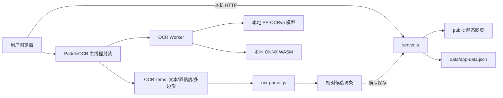

# 拾词 · 本地英语背单词学习工具交接文档

> 本文档用于把项目完整交接给新的对话、Agent 或开发者。接手者应先通读“当前状态”“不可破坏的边界”“OCR 踩坑记录”和“验证口径”，再修改代码。
>
> 这是一份活文档。后续出现重要设计调整、验证结果或新坑点时，请继续更新本文，而不是另建互相矛盾的交接说明。

## 1. 一句话结论

项目已经是一个可以在 Windows 上真实运行的本地英语背单词工具。`v1.2.0` 把数据链升级为“英文 + 可选词性 + 中文释义”：教材单词词性会进入词库，并贯穿每日认读、每日拼写、到期复习、自主认读和自主拼写；词组仍不要求词性。OCR 先完成原有中英文配对，再沿每条配对行单独附加词性，不会因词性识别改变已有配对。真实 89 条词库已在完整备份后迁移：38 个词组保持空词性，51 个单词全部由本机教材照片补全，未使用词典推断，学习状态和计划引用不变。四种拼写场景不朗读英文且不提供发音按钮。自动测试为 31 pass、0 fail。

Windows 已完成真实启动和浏览器 OCR 验收。用户已确认前期 `v1.1.1` 在真实 Mac 设备上能够正常启动和运行；`v1.2.0` 没有修改 Mac 启动脚本或平台运行资源，但尚未在 Mac 上单独重复完整 OCR、发音和备份回归。

### 1.1 当前版本与 Git 基线

- 产品版本：`1.2.0`，以 `package.json` 和 `package-lock.json` 为版本事实源。
- Git 仓库：已初始化，默认分支为 `main`。
- 首次基线提交：`340876a v1.0.0 首次提交`。
- 第二次功能提交：`1.1.0` 每日新词计划、自主复习、首页紧凑布局、学习插画和星光勋章。
- 第三次发布：`1.1.1` 词库批量删除、透视 OCR 配对修复、斜杠短语支持和准确重试提示。
- 第四次发布：`1.2.0` 词性识别、保存与学习提示，真实词库兼容迁移，以及取消拼写场景英文发音提示。
- 首次提交完成时工作区干净，自动测试为 16 pass、0 fail。
- `.gitignore` 明确排除用户真实词库 `data/app-data.json`、自动备份 `data/backups/`、整个 `样例/` 目录、日志、`node_modules` 和系统杂项文件。
- 被忽略的数据和样例仍保留在本机，只是不进入 Git；不要为了追求“仓库完整”强行提交这些内容。
- 本交接文档已同步记录词性增强与真实词库迁移；后续接手仍应以工作区中的最新 `HANDOFF.md` 为准，并用 `git status` 判断是否又产生新的未提交变更。

## 2. 项目位置与用途

工作区根目录：

```text
D:\CodeX\family work\HuyiTing Project\英语背单词学习工具
```

目标用户是初中阶段的女孩及其家长。产品不是面向开发者的后台系统，而是需要简单、稳定、低操作成本的家庭学习工具。

核心目标：

1. 用教材照片快速建立本地单词库。
2. 用认读卡片和拼写练习帮助逐个掌握词组。
3. 第一次拼错的内容进入强化循环，需要随后连续答对两次。
4. 按 1、3、7、14、30 天节奏复习。
5. 使用操作系统和浏览器自带英文语音朗读。
6. 照片、词库和学习记录只在本机处理和保存。
7. Windows 和 Mac 共用同一套网页代码及数据格式。

## 3. 用户已经确认的产品决策

- 交付形式是“本地网页 + Node.js 小型本地服务器”，不是云网站。
- Windows 直接使用 `start-windows.bat`，不需要再改成其他桌面格式。
- Mac 使用 `start.command`；`v1.1.1` 已由用户在真实设备上确认可启动、可运行。
- OCR 默认全自动；正常照片不要求用户先裁剪或手工旋转。
- 横置照片优先准确率：首轮判断方向后自动物理转正并复识别一次；只有最佳结果为 `0` 组可靠中英文配对时，才显示旋转重试界面。
- 单词保存教材词性，多词性按教材顺序使用 `/` 连接；词组不要求词性。单词词性缺失或低置信度时允许保存，但必须标记待检查。
- 照片不上传、不写入数据目录，完成识别后释放引用；只有失败等待重试时暂时保留当前照片对象。
- 词库允许相同英文重复导入，每条记录独立学习。
- 服务器词库接口、学习记录和启动方式在 OCR 替换过程中保持兼容。
- Git 只管理程序、离线 OCR 资源、测试和文档；真实词库、备份和教材样例不进入版本库。

## 4. 当前功能状态

| 功能 | 当前状态 | 说明 |
|---|---|---|
| Windows 启动 | 已实现并实测 | 双击 `start-windows.bat` |
| Mac 启动 | 已实现，前期版本已实机验证 | `v1.1.1` 已确认可启动运行；需要 Node.js 22+，首次可能需 `chmod +x start.command` |
| 照片上传 | 已实现 | JPG、JPEG、PNG，多图选择 |
| 离线 OCR | 已实现并真实验收 | PaddleOCR.js 0.4.2、PP-OCRv5 mobile |
| 自动方向判断 | 已实现 | 首轮尝试四方向坐标；横置照片自动物理转正并追加一轮 OCR |
| 中英表格配对 | 已实现 | 自动选择英文列和中文释义列并单调动态配对；词性在配对完成后独立附加 |
| OCR 噪声过滤 | 已实现 | 排除页眉、序号、说明文字、低置信度碎片和无配对页边内容 |
| 教材标记清洗 | 已实现 | 自动去除词首教材星号，星号不进入词库；单词内部异常星号仍拒绝 |
| OCR 校对 | 已实现 | 英文、词性、中文均可编辑；缺少或低置信度词性会明确提示 |
| 失败旋转重试 | 已实现 | 左转、右转、重新识别，仅失败时出现 |
| 手工录入 | 已实现 | 兼容两列格式，并支持 `英文<TAB>词性<TAB>中文释义` |
| 词库管理 | 已实现 | 搜索英文、中文和词性；支持编辑词性、重学、删除和批量删除 |
| 每日新词计划 | 已实现并真实验收 | 显示全部新词；每天自选 0 至全部数量；固定当天词条；开始后只能增加 |
| 新词认读 | 已实现 | 卡片展示英文、词性、中文和自动发音 |
| 拼写练习 | 已实现 | 只看中文和词性后输入英文；不自动朗读，也不提供发音按钮；词组隐藏词性区域 |
| 错词强化循环 | 已实现 | 拼错后稍后再出现，并要求连续答对两次 |
| 间隔复习 | 已实现 | 1、3、7、14、30 天 |
| 自主复习 | 已实现并真实验收 | 自动抽取或手动勾选；自由认读/拼写；正式拼写；错词强化循环 |
| 发音 | 已实现 | Web Speech API，优先英文系统语音 |
| 备份与恢复 | 已实现 | JSON 导出、恢复前自动备份旧数据 |
| 安全退出 | 已实现 | 网页按钮停止本地服务 |

## 5. 当前目录结构

```text
英语背单词学习工具/
├─ .gitignore                       # 排除真实数据、备份、样例和开发依赖
├─ HANDOFF.md                       # 本交接文档
├─ README.md                        # 面向普通使用者的简要说明
├─ package.json                     # 开发构建与测试命令
├─ package-lock.json                # 固定依赖版本
├─ server.js                        # 本地服务器、API、静态文件、数据持久化
├─ start-windows.bat                # Windows 启动入口
├─ start.command                    # macOS 启动入口
├─ vite.config.js                   # OCR 浏览器包构建配置
├─ data/
│  ├─ app-data.json                 # 用户真实词库与学习记录，禁止随意覆盖或删除
│  └─ backups/                      # 恢复操作生成的旧数据备份
├─ public/
│  ├─ index.html                    # 页面结构
│  ├─ styles.css                    # 全站样式
│  ├─ app.js                        # 页面交互、学习流程、OCR 调用
│  ├─ ocr-parser.js                 # OCR 过滤、方向判断、中英配对
│  └─ vendor/paddleocr/
│     ├─ runtime/
│     │  ├─ paddle-ocr.js           # Vite 生成的浏览器运行包
│     │  └─ ocr-worker.js           # 独立 OCR Worker
│     ├─ models/
│     │  ├─ PP-OCRv5_mobile_det_onnx_infer.tar
│     │  └─ PP-OCRv5_mobile_rec_onnx_infer.tar
│     └─ wasm/                      # ONNX Runtime WASM/MJS 全部兼容变体
├─ src/
│  └─ ocr-runtime.js                # PaddleOCR 初始化及预测封装源文件
├─ scripts/
│  ├─ copy-ocr-assets.js            # 构建后复制 Worker/WASM 并检查模型
│  └─ migrate-part-of-speech.js     # 词性迁移：默认预览，--apply 时先备份再原子写入
├─ tests/
│  ├─ server.test.js                # API、学习、备份及离线资源测试
│  ├─ ocr-parser.test.js            # 四方向、缺失释义、多列表格测试
│  ├─ migration.test.js             # 词性迁移、只增字段及备份测试
│  └─ fixtures/
│     ├─ expected-ocr.json          # 固定 11 组 OCR 基准
│     ├─ expected-ocr-e7bd80.json   # 固定 10 组多列表格及教材词性基准
│     ├─ expected-ocr-ad34e2.json   # 固定 7 组带星号词表及教材词性基准
│     ├─ expected-ocr-7ece03.json   # 固定 26 组透视词表及教材词性基准
│     ├─ expected-ocr-5de9cb.json   # 用户提供的 8 组单词与词性基准
│     ├─ expected-ocr-0bab9e.json   # 用户提供的 20 组词组无词性基准
│     ├─ expected-ocr-081879.json   # 真实词库 5 个单词教材词性基准
│     └─ expected-ocr-90154c.json   # 真实词库 12 个单词教材词性基准
├─ Mac安装包/                       # 本机专用安装材料，被 Git 忽略，禁止暂存
└─ 样例/
   ├─ 4f214b0444e10cfc45bad2c5fbf92f42.jpg  # 11 组关键 OCR 回归照片
   ├─ e7bd80ecd5782849cf6e21bd5df2874d.jpg  # 10 组横置多列表格照片
   └─ ad34e2f37e4c99acdc2c8670b4231bb6.jpg  # 7 组带星号词表照片
```

说明：普通使用不依赖 `node_modules`。当前开发期因离线迁移使用 `wordpos 2.1.0` 安装了开发依赖，但本次 51 个单词最终全部由教材照片补全，实际迁移没有使用词典推断。除非修改 OCR 运行资源，不要无意义地重建约 138 MB 资源。

说明：`data/` 和 `样例/` 在本机存在，但其中的真实数据、备份和照片均被 Git 忽略。首次提交包含三个期望 JSON，因为它们只是人工确认的文本基准，不包含原始教材照片或用户词库。

## 6. 启动、测试与重新构建

### 6.1 普通使用

Windows：

```text
双击 start-windows.bat
```

Mac：

```text
第一次：chmod +x start.command
以后：双击 start.command
```

要求安装 Node.js 22 或更高版本。当前 Windows 开发机验证时使用的是 Node.js 24 系列。

服务器默认从 `4173` 端口开始。如果端口被占用，会继续尝试后续端口。也可临时指定：

```powershell
$env:PORT='43174'
node server.js
```

### 6.2 自动测试

不需要安装依赖即可执行：

```powershell
npm.cmd test
```

也可直接执行：

```powershell
node --test tests/*.test.js
```

注意：Windows PowerShell 的执行策略可能阻止 `npm.ps1`，此时使用 `npm.cmd`，不要误判为 npm 未安装。

重要数据提醒：`tests/server.test.js` 和迁移测试都使用系统临时目录中的独立数据文件，不读取、不替换，也不恢复真实 `data/app-data.json`。真实浏览器开发验收同样必须显式设置临时 `DATA_FILE` 和 `BACKUP_DIR`。

### 6.3 词性迁移

迁移脚本默认只预览，不写入：

```powershell
npm.cmd run migrate:pos
```

确认统计后才应用：

```powershell
npm.cmd run migrate:pos -- --apply
```

应用前会在 `data/backups/` 创建 `pre-part-of-speech-<时间戳>.json` 完整备份，再原子替换真实数据。2026-07-17 实际迁移结果为：总数 89、词组 38、教材匹配 51、词典推断 0、未解决 0；备份 SHA-256 与迁移前真实数据一致。

### 6.4 重新构建 OCR 浏览器包

只有修改了 `src/ocr-runtime.js`、PaddleOCR 版本或构建配置时才需要：

```powershell
npm.cmd install --include=dev
npm.cmd run build
npm.cmd test
```

构建完成后，普通运行不再依赖 `node_modules`。确认测试通过后可以删除 `node_modules`，但不要删除 `public/vendor/paddleocr`。

两个模型文件不是构建脚本下载的；`scripts/copy-ocr-assets.js` 只检查它们是否存在。若模型缺失，构建会明确失败。模型必须继续保留在：

```text
public/vendor/paddleocr/models/
```

### 6.5 Git 日常操作

首次仓库已建立，无需再次执行 `git init`。后续修改建议：

```powershell
git status --short
npm.cmd test
git diff --check
git add <本次明确修改的文件>
git diff --cached --stat
git commit -m "清晰描述本次变更"
```

提交前必须确认暂存清单中没有 `data/`、`样例/`、`node_modules/` 或临时浏览器诊断文件。若需要发布新版本，应同时修改 `package.json` 与 `package-lock.json` 的版本号；不要只靠提交信息宣称版本变化。

## 7. 整体架构



这里不能直接双击 `index.html` 使用。PaddleOCR 需要通过 HTTP 读取模型和 WASM，同时数据 API 也由 `server.js` 提供，所以必须用启动脚本启动本地服务。

## 8. 数据与 API

### 8.1 数据文件

真实数据位于：

```text
data/app-data.json
```

基本结构：

```json
{
  "version": 1,
  "words": [],
  "reviews": [],
  "settings": {}
}
```

单词记录包含：

- `id`
- `spelling`
- `partOfSpeech`：规范化英文缩写；词组及未补全单词为空字符串
- `partOfSpeechNeedsReview`：缺失、低置信度、陌生缩写或词典推断时为 `true`
- `meaning`
- `status`：`new`、`learning`、`review`、`mastered`
- `reviewStep`
- `nextDueDate`
- `failureCount`
- `createdAt`
- `updatedAt`

复习记录包含会话、答案、是否正确、复习时间及阶段变化等信息。

当天选择新词后，设置中增加：

```json
{
  "dailyNewPlan": {
    "date": "YYYY-MM-DD",
    "count": 5,
    "wordIds": [],
    "started": false
  }
}
```

旧数据和旧备份中的 `dailyNewLimit` 仍可读取，但不再作为固定每日数量使用。

旧备份缺少两个词性字段时仍可恢复。服务端读取和恢复时会补齐兼容字段：多词单元按词组处理并保持空词性；单词缺少词性时允许保存，但 `partOfSpeechNeedsReview` 必须为 `true`。新备份完整保留两个字段，顶层数据结构版本仍为 `1`。

### 8.2 API

| 方法 | 路径 | 用途 |
|---|---|---|
| GET | `/api/state` | 获取词库、复习记录、设置和日期信息 |
| PUT | `/api/settings/daily-new-plan` | 保存或增加当天新词计划 |
| POST | `/api/settings/daily-new-plan/start` | 标记当天计划已经开始，之后禁止减少 |
| POST | `/api/words/import` | 批量导入校对后的词条 |
| PUT | `/api/words/:id` | 修改英文、词性和中文释义 |
| DELETE | `/api/words` | 批量删除词条，并清理学习记录和当天计划引用 |
| DELETE | `/api/words/:id` | 删除词条及相关学习记录 |
| POST | `/api/words/:id?action=reset` | 把词条恢复为未学习状态 |
| POST | `/api/attempts` | 保存一次拼写结果并推进复习阶段 |
| GET | `/api/backup` | 导出 JSON 备份 |
| POST | `/api/restore` | 恢复备份 |
| POST | `/api/shutdown` | 安全停止本地服务 |

服务器保存数据时使用临时文件后原子替换，降低写入中断造成文件损坏的风险。

## 9. 学习与复习逻辑

首页把任务分为：

- 到期复习：`learning`，或 `review` 且 `nextDueDate` 已到。
- 今日新词：首页显示全部 `new` 状态数量，由用户每天选择 0 至全部；服务端保存固定 `wordIds`，刷新后不会换成另一批。

新词先进入认读卡片，然后进入拼写阶段。

拼写阶段包括每日拼写、到期复习、自由拼写和正式复习。四种场景共用同一张拼写卡，均禁止自动朗读英文，同时不显示手动发音按钮，避免通过发音获得拼写答案。每日新词认读、自主认读和词库中的手动发音保持可用。

拼写规则：

- 没有拼错过：答对一次即可完成本轮。
- 拼错：记录错误、稍后重新排入队列。
- 拼错后的同一词必须连续答对两次才完成本轮。
- 错误会把服务端词条状态设为 `learning`，复习阶段重置。
- 完成本轮后进入 1、3、7、14、30 天复习节奏。
- 完成最后一个阶段后状态变为 `mastered`。

不要只改前端队列而不改 `/api/attempts`，否则页面表现和持久化状态会不一致。

自主复习只允许状态不是 `new` 的词。自由练习不会改变状态、阶段和下次复习日期，但错误会增加 `failureCount`；正式复习沿用现有阶段推进规则。手动拼写答错后同样需要连续答对两次。答题记录使用 `source` 区分 `scheduled`、`manual-free` 和 `manual-formal`。

## 10. OCR 当前实现

### 10.1 固定版本和资源

- `@paddleocr/paddleocr-js`: `0.4.2`
- Vite: `8.1.4`
- 检测模型：PP-OCRv5 mobile detection，约 4.84 MB
- 中英文识别模型：PP-OCRv5 mobile recognition，约 16.70 MB
- 浏览器主运行包：约 25.70 MB
- 独立 OCR Worker：约 11.34 MB
- OCR 本地资源总计约 138 MB

运行模式：

- Worker 模式
- WASM 后端
- SIMD
- 两个线程
- 检测批次 1
- 识别批次 8

### 10.2 离线保证

所有模型、Worker、OpenCV 相关代码和 ONNX WASM 都位于项目中。

`server.js` 对静态页面设置了 Content Security Policy，其中：

```text
connect-src 'self' data:
```

`data:` 仅供本地打包的 WASM 初始化使用，仍不允许访问外部 HTTP(S) 服务。真实浏览器在该限制下完成了原始 JPEG 识别，因此不是“资源看似在本地、实际仍偷偷访问 CDN”。

### 10.3 OCR 数据流

1. `public/app.js` 接收浏览器 `File`。
2. 正常识别直接把原始彩色图片交给 PaddleOCR，不再做统一灰度和强对比度预处理。
3. `src/ocr-runtime.js` 初始化 Worker 和本地模型，返回 PaddleOCR `items`。
4. 每个 item 包含：`text`、`score`、`poly`。
5. `public/ocr-parser.js` 分别按四个方向转换坐标，并按横坐标选择英文列和中文释义列。
6. 筛选英文和中文释义候选，排除音标、表头和页脚；词性缩写作为独立候选保留。
7. 先选择英文列和中文列并完成单调配对，再在两列之间沿每条配对行插值匹配词性；词组强制忽略附近词性噪声。
8. 根据配对数量、缺失数量、词性缺失、行距、顺序和置信度选择最佳方向。
9. 若最佳方向不是 0°，网页把原图物理转正，再运行一次 OCR；两轮只保留质量更好的结果。
10. 输出包含可选词性的 `ImportCandidate[]` 给校对表。

### 10.4 英文与中文过滤规则

英文候选：

- 最低置信度 0.8。
- 至少两个小写字母。
- 只允许英文字母、空格、句点、连字符、逗号和撇号等词组字符。
- 小写字母占非空格字符比例至少 45%。

中文候选：

- 最低置信度 0.85。
- 至少一个汉字，最低置信度仍为 0.85。
- 排除“序号”“英文”“音标”“词性”“中文释义”“单词板块”“词组板块”和“粗体词……”等页眉页脚。

高置信度英文在表格有效范围内找不到中文时会保留，中文留空并标记 `missing`。服务器现有非空校验会阻止缺少释义的词条直接保存。

### 10.5 方向评分和配对

首轮 OCR 后，解析器对坐标尝试：

```text
0°、90°、180°、270°
```

每个方向综合考虑：

- 成功配对数量。
- 配对率。
- 平均置信度。
- 英文栏是否位于中文栏左侧。
- 同行距离。

中英行不能使用简单的“每个英文找最近中文”贪心算法。当前先按横坐标聚类，比较各英文列和中文列组合，再使用保持行顺序的动态配对：优先最大化配对数量，再最小化总距离。这样既能避免某一行文字框中心偏移后整体错位，也能处理“序号、英文、音标、词性、中文释义”多列表格。

中文释义允许一个高置信度汉字，例如 `板`；最低置信度仍为 0.85，因此不会仅靠放宽字数规则接纳低置信度误字。词性缩写如 `adj.`、`n.`、`v.` 不会当成英文词条，而是在中英文配对完成后独立附加。

### 10.6 校对状态

- `clear` → 清晰
- `check` → 建议检查
- `missing` → 缺少释义
- `missing-pos` → 缺少词性（只用于单词，允许保存）
- `manual` → 手工录入

综合置信度取英文和中文置信度中的较低值。达到 0.92 显示“清晰”，否则显示“建议检查”。

### 10.7 旋转重试

首轮判断为横置时会先自动物理转正并复识别一次，最多追加一轮。两轮按成功配对数、缺失数、词性缺失数、未配对中文数、待检查数、配对率和平均置信度选择最佳结果。只有最佳结果为 `0` 组可靠中英文配对时才显示重试区；已有至少一组可靠配对时保留候选并进入校对。

用户点击旋转后，重试时才真正把图片绘制到旋转后的 Canvas 并重新运行 OCR。

## 11. 固定 OCR 回归样例

关键原图：

```text
样例/4f214b0444e10cfc45bad2c5fbf92f42.jpg
```

特点：

- 图片横置。
- 原图没有可靠方向信息。
- 中英文混排。
- 整页表格带阴影和页面边缘内容。
- 下方还有练习说明和另一页局部内容。

固定期望结果位于：

```text
tests/fixtures/expected-ocr.json
```

完整 11 组为：

1. `test a talk light` / `测试一盏谈话灯`
2. `try windsurfing` / `尝试帆板运动`
3. `take up roof gardening` / `从事屋顶园艺`
4. `act in a play` / `在戏剧中扮演角色`
5. `go rock climbing` / `去攀岩`
6. `make fruit animals` / `制作水果动物`
7. `climb up the rock wall` / `爬上岩壁`
8. `form a new word` / `创造一个新词`
9. `in this way` / `用这种方式`
10. `share with sb. about sth.` / `和某人分享某事（物）`
11. `discover something new` / `发现新事物`

页眉、序号、下方练习说明和右侧页面内容不得进入候选表。

第二张多列回归原图：

```text
样例/e7bd80ecd5782849cf6e21bd5df2874d.jpg
```

固定期望结果位于 `tests/fixtures/expected-ocr-e7bd80.json`，共 10 组：`curious`、`magazine`、`test`、`windsurf`、`feeling`、`brave`、`challenge`、`machine`、`traffic`、`board` 及其对应中文释义。验收要求 `machine / 机器`、`traffic / 交通`、`board / 板` 正确，不得混入音标、词性、表头或页脚。

第三张带星号词表原图：

```text
样例/ad34e2f37e4c99acdc2c8670b4231bb6.jpg
```

固定期望结果位于 `tests/fixtures/expected-ocr-ad34e2.json`，共 7 组：`print`、`printing`、`improve`、`camp`、`grow`、`fully`、`clarification` 及其对应中文释义。教材中的 `*fully`、`*clarification` 必须清洗为不带星号的英文后再导入，星号不得进入词库。

## 12. 开发全过程

### 阶段一：确定产品形态

最初需求是本地 HTML 学习工具，包含照片建词库、卡片背诵、错词反复记忆和发音。

为了同时支持 Windows 和 Mac，采用了：

- 一套 HTML/CSS/JavaScript 前端。
- Node.js 本地服务器。
- Windows 和 Mac 各自一个启动脚本。
- JSON 本地数据文件。

没有使用 Electron，是为了降低包体、安装和维护成本。

### 阶段二：完成基础学习工具

实现了：

- 首页学习计划。
- 词库导入和管理。
- 新词认读卡片。
- 拼写练习。
- 错词循环。
- 间隔复习。
- 系统语音发音。
- 数据备份与恢复。
- 安全退出。

### 阶段三：发现 Tesseract OCR 根本性问题

最初 OCR 使用 Tesseract.js，并对整张图片做灰度、缩放和增强对比度。

用户上传关键样例后，结果出现 `rs`、`i N`、`CAREER` 等完全无关碎片，中英文行列也全部错乱。

确认根因不是简单阈值调优：

- 原图横置且缺少可靠方向信息。
- 中英混排。
- 带大面积阴影。
- 整页表格和页边内容一起识别。
- Tesseract 一次处理整页时，方向、文字和布局同时失败。

尝试旋转和裁剪只能得到部分英文，仍有噪声和错配，继续围绕 Tesseract 调参没有价值。

### 阶段四：浏览器验证 PaddleOCR

在独立临时浏览器试验中使用官方 PaddleOCR.js PP-OCRv5 直接读取未经旋转、未经裁剪、未经强对比度处理的原图。

结果成功识别：

- 全部 11 条英文词组。
- 全部 11 条中文释义。
- 主要置信度约 0.95～0.999。

因此决定完整替换 OCR 引擎，而不是把 PaddleOCR 作为 Tesseract 失败后的第二套引擎。这样避免两套大模型和两套逻辑并存。

### 阶段五：实现本地 PaddleOCR 与坐标配对

实施内容：

- 固定 PaddleOCR.js 0.4.2。
- 本地打包 PP-OCRv5 检测和识别模型。
- 本地打包 Worker 与 ONNX WASM。
- 使用原始彩色照片。
- 独立实现四方向坐标转换和表格解析。
- 增加校对置信度状态与失败旋转重试。
- 增加固定 OCR 基准和四方向解析测试。

### 阶段六：真实浏览器验收与收尾

真实浏览器测试发现并修复了 Worker、WASM 和行配对问题。最终原始照片在约 8.3 秒的检查点已经完整显示 11 组结果，低于 30 秒目标。

随后：

- 加入 CSP，强制阻止非本机网络请求。
- 删除旧 Tesseract 运行包、核心 WASM、语言模型和预处理代码。
- 删除临时浏览器测试文件。
- 删除开发期 `node_modules`。
- 重新执行全套测试。

### 阶段七：横置多列表格优化

第二张清晰教材照片暴露出“只旋转坐标、不物理转正”的上限：首轮漏掉 `test` 和 `机器`，把 `traffic` 识别为 `traffie`，把 `板` 低置信度误识别为“商”。同图物理转正后，PaddleOCR 原始结果能完整识别 10 组。因此新增横置照片自动转正复识别、按列选择英文和中文释义、多列表头与词性过滤、单字高置信度释义支持，并在真实浏览器中完成验收。

### 阶段八：教材词首星号清洗

第三张照片中的 `*fully` 和 `*clarification` 已被 OCR 识别，但旧英文规则要求首字符必须是字母，导致两行及其中文释义在整理阶段被过滤。当前只允许并移除词首教材星号 `*`、`＊`、`﹡`、`✱`、`✲`、`✳`，再执行原有英文合法性检查；单词中间或末尾的星号仍会被拒绝。

### 阶段九：建立 1.0.0 Git 基线

功能与三张样例回归稳定后，将工作区初始化为 Git 仓库，默认分支为 `main`，以 `340876a v1.0.0 首次提交` 建立首个版本基线。提交前完成了以下检查：

- `package.json` 与 `package-lock.json` 均为 `1.0.0`。
- 16 项自动测试全部通过。
- 暂存清单不包含用户词库、备份或 `样例/` 目录。
- `.gitignore` 保留 `data/app-data.json`、`data/backups/` 和 `样例/` 的本机内容，但阻止其进入版本历史。
- 离线 OCR 模型、Worker、WASM 和运行包属于程序运行必需资源，已纳入首次提交；不能把它们误当成普通构建垃圾忽略。

### 阶段十：1.1.0 每日计划与自主复习

首页不再固定每天 10 个新词，而是显示全部未学习新词并让用户每天选择 0 至全部数量。当天计划保存固定词条 ID，刷新或中途退出不会额外补入新词；开始学习后只允许增加数量。

新增独立“自主复习”入口：可以自动抽取易错词、已掌握或全部已学词，也可以手动搜索勾选。自由练习支持认读和拼写，错误只增加易错统计；正式复习使用拼写并推进原有复习阶段。自主拼写继续保留错词回滚和连续答对两次规则。

服务端增加 `DATA_FILE` 环境变量。自动测试使用系统临时目录中的独立数据文件，不再替换真实词库。

1.1.0 首页随后完成桌面端紧凑化：减少顶部、统计卡和侧栏导航留白，把“今日计划、数量选择、操作按钮”改成横向三段式。首页功能区下方新增英语学习主题横幅插画，正式素材位于 `public/assets/home-english-study-banner.png`，使用与现有界面一致的森林绿、米白和杏色，并针对手机端单独设置人物裁切位置。1980×1248 视口下插画完整填入原留白区域且页面无纵向、横向溢出；390×844 手机视口保持单列且没有横向溢出。

首页“连续学习”从简单数字色块升级为星光勋章：平时主星保持低幅度慢呼吸，外圈不旋转，只做非常轻微的明暗变化；只有连续天数真实增加时，才播放一次星星绽放、主星放大和数字弹跳，普通刷新不会重复庆祝。勋章会按 0、1、3、7、14、30 天等阶段显示不同鼓励语，并为 `prefers-reduced-motion` 用户自动缩短动效。

### 阶段十一：词库多选与批量删除

- “我的词库”表格增加逐行勾选框、当前筛选结果全选框、已选数量和批量删除按钮。
- 搜索或切换状态筛选时，已经勾选的其他词条会继续保留；表头按当前结果显示未选、全选或部分选中。
- 批量删除前通过弹窗明确数量和部分词名，确认后一次提交；单条删除功能继续保留。
- 服务端原子校验全部词条 ID，成功删除后同步移除相关答题记录，并清理当天新词计划中的失效引用。
- 使用独立临时词库完成真实浏览器验收，没有读取或修改真实 `data/app-data.json`。

### 阶段十二：修复透视词表整列串行

照片 `样例/2/7ece03fa1b57cbb5a1a748fd19012f31.jpg` 的表格横线因拍摄透视从右上向左下倾斜，而且倾斜量随页面高度变化。旧解析器只比较文字框中心纵坐标，导致 `mascot / 吉祥物` 的中文框更接近下一行英文，从第一项开始整列错配。

修复包含三部分：利用“序号、单词、音标、词性、中文释义”表头估算整体行倾斜；当两列数量和行距形状一致时按有序行形状直接对齐，避免弯曲页面被固定斜率再次错开；列聚类改用文字框左边界，不再因中文释义长短不同而把同一列拆开。原始 JPEG 已在 Windows 应用内浏览器重新跑完整 OCR，26 组全部正确、配对率 100%。

### 阶段十三：斜杠短语与错误旋转提示

两行词组照片中的 `meet with/face many difficulties` 虽然 OCR 清晰，但旧英文合法性规则禁止 `/`，导致第一行在解析阶段被删除；只剩一组后，旧规则又把“少于两组”统一解释为方向问题，因此无论怎样旋转都不会成功。

当前允许字母之间的单斜杠，并统一清理斜杠两侧空格；开头、结尾、连续斜杠仍会被拒绝，服务端导入规则同步更新。有效单组或双组词表不再因为数量少而触发旋转；只有 0 组配对才进入重试区域，页面文案也改为区分“可能方向不正”和“没有形成可靠配对”。同时排除“少量中文括号＋大段英文句子”的页外内容，原始 JPEG 最终只输出两组目标短语，配对率 100%。

### 阶段十四：词性识别、保存、学习提示与真实词库迁移

- 数据记录增加 `partOfSpeech` 和 `partOfSpeechNeedsReview`，旧数据与旧备份继续兼容。
- OCR 在中英文配对之后独立匹配词性；词组强制空词性，单词漏检时提示但允许保存。
- 校对、手工三列录入、词库搜索/编辑、每日认读/拼写、自主认读/拼写全部贯通词性。
- 增加 `wordpos 2.1.0` 作为开发期离线兜底，但真实 51 个单词最终全部由保留的教材照片人工确认，词典推断为 0。
- 迁移先预览，再备份并原子写入。实际结果：89 条总数和所有 ID、状态、复习阶段、错误次数、计划引用不变；38 个词组空词性，51 个单词获得教材词性。
- 本阶段最终发布为 `1.2.0`，只修改词性数据链和学习界面，没有重建约 138 MB OCR 运行资源。

## 13. 关键踩坑与解决办法

### 13.1 不要再对样例使用 Tesseract 调参

现象：旋转、灰度、对比度、裁剪后只能局部改善，无法同时恢复方向、文字和表格结构。

结论：这类横置中英表格应直接使用 PaddleOCR PP-OCRv5。不要重新引入 Tesseract 作为默认或回退，否则会增加包体和维护复杂度，且回退质量很差。

### 13.2 不要默认做强灰度和强对比度处理

旧流程会破坏阴影区域的层次和细笔画。PaddleOCR 对原始彩色照片表现更好。

除非有新的明确回归样例证明预处理有收益，否则保持原图输入。

### 13.3 Vite 输出目录不能递归复制 public

错误配置曾把 `outDir` 放在：

```text
public/vendor/paddleocr/runtime
```

同时保留 Vite 默认 `publicDir`，导致构建时把 `public` 复制到 `public` 内部，形成：

```text
runtime/vendor/paddleocr/runtime/vendor/paddleocr/runtime/...
```

目录无限递归，Windows 还会触发超长路径，普通 `Remove-Item` 难以清理。

当前修复：

```js
publicDir: false
```

不要删除该配置。若改变输出位置，先确认不会把父目录复制到子目录。

### 13.4 IIFE 构建会破坏 Worker 的 import.meta.url

最初尝试把运行包构建成 IIFE 全局变量，Vite/Rolldown 会把 `import.meta` 替换为空对象，PaddleOCR 默认 Worker 地址失效。

当前方案：

- 构建为 ES module。
- `index.html` 用 `type="module"` 加载运行包和 `app.js`。
- `src/ocr-runtime.js` 显式挂载 `globalThis.PaddleOCRRuntime`。

不要轻易改回 IIFE。

### 13.5 PaddleOCR 默认 Worker 在当前构建下变成大型 data URL

默认 Worker 被内联为 Base64 data URL，真实浏览器中出现 `OCR worker failed`。

当前方案显式指定同源 Worker：

```js
createWorker: () => new Worker(
  "/vendor/paddleocr/runtime/ocr-worker.js",
  { type: "module" }
)
```

构建后由 `scripts/copy-ocr-assets.js` 把官方 Worker 复制为固定文件名。

### 13.6 只复制标准 ONNX WASM 不够

最初只复制：

```text
ort-wasm-simd-threaded.mjs
ort-wasm-simd-threaded.wasm
```

真实浏览器实际请求：

```text
ort-wasm-simd-threaded.jsep.mjs
ort-wasm-simd-threaded.jsep.wasm
```

导致：

```text
no available backend found
Failed to fetch dynamically imported module
```

当前做法是把 `ort-wasm*.mjs` 和 `ort-wasm*.wasm` 的兼容变体全部复制到本地。不要为了减少包体随意删掉某个变体，除非在目标浏览器矩阵中重新验证。

### 13.7 最近行贪心配对会整体错一行

最初配对方式是每个英文找最近的未使用中文。真实输出曾变成：

```text
test a talk light / 尝试帆板运动
try windsurfing / 从事屋顶园艺
...
go rock climbing / 空
```

原因是不同长度文本的多边形中心会有偏移，第一条中文稍远，贪心算法选择了下一行，后面持续错位。

当前使用保持顺序的动态规划：

- 第一目标：配对数量最多。
- 第二目标：总同行距离最小。

表格本身具有序号顺序，利用顺序比单纯最近距离稳定得多。

### 13.8 图片中的尾部圆点需要清洗

样例第七条中文被识别为：

```text
爬上岩壁·
```

解析器只对中文释义尾部的 `·`、`•` 做清理，不应全局删除英文句点，否则会破坏：

```text
share with sb. about sth.
```

### 13.9 端口冲突会让测试误连到正在运行的应用

早期测试固定访问 4173。如果用户已有服务占用该端口，测试可能访问错误进程。

当前：

- `server.js` 支持 `PORT` 环境变量。
- 自动测试使用 43173。

自动测试和真实浏览器开发验收都已改用独立临时数据文件。若新增测试，必须继续通过 `DATA_FILE` 和 `BACKUP_DIR` 隔离，不能退回共享真实数据。

### 13.10 Windows PowerShell 中文和 npm 注意事项

- 查看中文文件时使用 UTF-8，例如 `Get-Content -Encoding utf8`。
- 必要时先执行 `chcp 65001`，避免把正常中文误判为文件乱码。
- PowerShell 可能阻止 `npm.ps1`，使用 `npm.cmd`。
- 删除递归目录前必须核对解析后的绝对路径仍在工作区内。

### 13.11 只旋转坐标不等于把图片转正

第二张照片首轮最佳方向为 270°，旧实现只是把 OCR 框坐标旋转后配对，OCR 模型本身仍在读取横置文字。结果出现：

- `test` 整行漏检。
- `机器` 没有识别结果。
- `traffic` 被识别为 `traffie`。
- `板` 被低置信度误识别为“商”。

直接降低阈值只能把“商”这种错误放进候选，不能补回根本没有识别到的 `test` 和 `机器`。当前做法是首轮确定方向后，把横置图片物理转正，再追加一轮 OCR；最多两轮，并按配对数、缺失数、未配对中文数、待检查数、配对率和平均置信度选择最佳结果。第二轮失败时保留首轮结果，不能因为自动复核异常把已有候选清空。

### 13.12 多列表格不能把所有英文和中文混成两列

物理转正后，第二张照片的 OCR 原始文字已经完整，但旧解析器会把 `adj.`、表头“音标/词性”和页脚说明加入配对，导致中英文整体错位。

当前解析器先按横坐标聚类，再比较英文列与中文列组合，选择配对数量和质量最好的两列。已明确过滤：

- 表头：序号、英文、词组、音标、词性、中文释义、单词板块、词组板块。
- 词性缩写：`n.`、`v.`、`adj.`、`adv.` 等。
- 页脚：包含“粗体词”等教材说明。

一字中文释义不能一概删除。`板` 是合法释义，因此规则改为“至少一个汉字且置信度不低于 0.85”；低置信度“商”仍会被拒绝。经验是：阈值必须结合列位置、行顺序和表格上下文使用，不能只靠字符数量做判断。

### 13.13 教材星号不是单词字符

第三张照片中 `*fully`、`*clarification` 的 OCR 实际已经成功，但旧英文正则要求首字符必须是字母，导致英文行被过滤，对应中文也因失去配对而消失。

当前仅清除词首教材标记 `*`、`＊`、`﹡`、`✱`、`✲`、`✳`，然后重新执行原有英文合法性校验。不要直接把星号加入所有合法英文字符，否则单词中间和末尾的 OCR 噪声也会进入词库。

### 13.14 OCR 原始结果、解析结果和界面结果要分层诊断

看到“缺少释义”或整行消失时，应按以下顺序判断：

1. OCR 原始 items 是否包含英文和中文。
2. 候选过滤是否因置信度、字符规则、表头或教材标记删除了文字。
3. 列选择和行配对是否把正确内容配给了错误行。
4. 界面是否只是把低质量结果标成“建议检查”或“缺少释义”。

第二张照片的 `机器` 属于 OCR 漏检，`板` 属于低置信度误识别，第三张照片的两个星号词属于识别成功后被规则过滤。三者表面都是“界面没显示”，但修复方法完全不同。不要看到结果缺失就先调低统一阈值。

### 13.15 验证载体和原始文件格式必须说清楚

早期应用内浏览器曾无法解码部分原始 JPEG，因此当时使用过同像素 PNG 副本。当前 Edge 验收已经直接使用用户提供的原始 JPEG 完成单词表、词组表和 26 行透视词表复核。

以后若再次遇到格式解码限制，仍必须分别汇报“同像素内容已通过 OCR 流程”和“原始文件格式是否在目标浏览器验证”，不能混写。

### 13.16 Git 首次提交不能带入真实数据和教材照片

程序代码、离线模型和测试期望文本可以提交；用户词库、恢复备份和教材照片不能提交。首次提交前同时使用 `.gitignore`、`git check-ignore -v` 和暂存清单交叉确认，不能只看资源管理器里文件是否存在。

离线 OCR 资源总量较大，但每个文件均低于常见单文件限制，并且是普通用户无依赖运行所必需的交付内容，因此首次基线保留这些文件。若未来要改用 Git LFS 或发布包，应先设计新的交付流程，不能直接从仓库删除运行资源。

### 13.17 透视页面不能只用文字框中心判断同行

透视拍摄的表格可能在页面上形成斜线甚至轻微曲线，同一逻辑行的中英文中心纵坐标相差近一整行。中文释义越长，文字框中心还会越向右移动；若用中心横坐标分列，长释义会被错误拆成另一列。

当前规则是：表头用于估算倾斜，同行顺序同时参考两列的归一化行距形状，列聚类统一使用文字框左边界。以后调整配对算法时，必须保留 `expected-ocr-7ece03.json` 的 26 组回归，不能退回“绝对纵坐标最近”或“中心横坐标聚类”。

### 13.18 OCR 清晰不等于解析规则会接受

OCR 引擎曾正确读出 `meet with/face many difficulties`，但解析器因 `/` 将整行过滤，界面却误报方向问题。排查“清晰文字为什么没出现”时，必须分别查看 OCR 原始文本、英文合法性过滤、配对结果和界面重试原因。

斜杠只允许出现在两个英文字母之间，不能全局放宽所有符号；中文释义若英文字母数量明显超过中文，也不能仅因包含一个中文词就当作释义，否则页面上方例句会混进词表。

### 13.19 词性不能用全局最近行贪心匹配

真实 26 行透视教材页中，部分词性没有被 OCR 识别。若按校正后的纵坐标给每个英文找最近词性，下一行词性可能被错误挂到上一行，后续出现连续串行。

当前实现严格保持原有英文—中文配对不变，再以每一对英文框和中文框为端点，按词性框的横坐标在线段上插值得到该行预期纵坐标，只接受距离阈值内的词性。这样能同时处理透视斜率和局部弯曲；漏识别会显示“缺少词性”，不会拿相邻行补位。回归测试必须保留“中间一行缺失词性，后续行不向上错挂”的场景。

## 14. 已完成的验证

### 14.1 自动测试

当前测试总数：31，全部通过。

覆盖：

- OCR 坐标 0°、90°、180°、270°后输出相同 11 组结果。
- 高置信度英文缺少中文时保留并标记。
- 无表格内容触发重试。
- 多列表格会排除音标、词性、表头和页脚，并保留高置信度单字释义。
- 透视倾斜且释义长短不一的 26 行词表不会发生整列串行。
- 斜杠连接的两行同义短语可完整配对，不会因数量少误提示旋转；服务端可正常保存规范化后的斜杠短语。
- 低置信度单字误识别不会进入释义候选。
- 词首教材星号会被安全移除，单词中间或末尾的异常星号仍被拒绝。
- 带星号样例会完整输出清洗后的 7 组词条。
- 8 行单词表逐行识别教材词性；20 行词组表全部保持空词性，页外练习不进入结果。
- 多词性规范化、低置信度/陌生缩写待检查、单词缺少词性提示和词组附近词性噪声隔离。
- 中间词性漏识别时，后续词性不会向上错挂。
- 首页与初始状态读取。
- PaddleOCR 主程序、Worker、模型和 WASM 均已离线打包。
- 重复英文分别导入。
- 非法英文或缺少释义被拒绝。
- 答错后状态重置。
- 完成本轮后进入一天复习。
- 每日新词数量允许为 0，固定当天词条，开始后禁止减少但允许增加。
- 自由练习错误只增加易错次数，不改变状态、阶段和复习日期。
- 自主复习拒绝未学习新词，正式认读被拒绝，正式拼写沿用复习阶段。
- 批量删除会去重并校验词条 ID，同步清理学习记录和当天计划；删除后当天计划仍可正常增加新词。
- 备份包含词库和学习记录。
- 导入、编辑、备份和恢复保留词性；旧格式备份自动补齐兼容字段。
- 词性迁移默认预览，应用时先备份再原子写入，并验证除词性字段外的数据不变。

最后一次执行命令：

```powershell
npm.cmd test
```

结果：31 pass，0 fail。

### 14.2 Windows 真实浏览器验证

已真实验证：

- 本地服务器启动。
- ES module 运行包加载。
- OCR Worker 启动。
- 本地模型和 WASM 加载。
- 用户原始照片完整识别。
- 11 组中英文顺序和配对正确。
- 页眉、序号、说明文字和页边内容未进入候选表。
- 正常结果不显示旋转重试。
- 校对状态正确显示。
- CSP 限制 `connect-src 'self' data:` 后仍能完成识别，未发生外部网络资源请求。
- 第二张横置多列表格照片的同像素无损 PNG 副本自动转正后正确输出 10 组，全部显示“清晰”，不显示旋转重试。
- 第二张照片中 `test / 测试；检测`、`machine / 机器`、`traffic / 交通`、`board / 板` 均正确。
- 第三张照片的同像素无损 PNG 副本正确输出 7 组；`fully / 完全地；全部地`、`clarification / 阐明；澄清` 均显示“清晰”，星号未进入英文。
- 原始 JPEG `7ece03fa1b57cbb5a1a748fd19012f31.jpg` 完整输出 26 组中英文，从 `mascot / 吉祥物` 到 `disappoint / 使失望；使落空` 均逐行正确；词性漏检时保持空白，不会把下一行词性错挂上来。
- 用户提供的原始单词表 JPEG `5de9cb68fe68983a4314eabbf9ef0326.jpg` 输出 8 组中英文，7 个词性直接识别正确；`alive` 的 `adj.` 未被 OCR 引擎读出，界面显示“缺少词性”，没有发生后续串行。
- 用户提供的原始词组表 JPEG `0bab9e0dd70d72242f166111e4dc0d62.jpg` 输出 20 个可见词组，全部词性为空，页外练习未进入结果。该图仍有两项原有中文 OCR 校对需求：首行释义截断、`after all` 释义漏检。
- 原始两行词组 JPEG 完整输出 `meet with/face many difficulties / 遇到/面临许多困难` 和 `do something wrong / 做错事`，配对率 100%，两项均为“清晰”，不会触发旋转或检查提示；页眉例句中的 `honest` 未进入候选。
- 使用独立临时词库显示全部 4 个未学习新词，每日计划选择 2 个后刷新仍保留同一计划。
- 完成 2 个计划新词后，首页未学习新词正确降为 2 个，计划不会自动补满。
- 自主复习自动抽取、手动勾选、自由认读和正式拼写均可正常进入并完成。
- 独立临时词库中的 `heart / n.`、`light / n. / adj.` 和词组 `in this way` 已走通每日认读、每日拼写和自主认读：单词词性在输入前可见，多词性紧凑显示，词组完全隐藏词性区域。
- 每日拼写、到期复习、自由拼写和正式复习进入每个词条时均不调用系统语音，拼写卡不显示发音按钮；每日新词认读、自主认读和词库手动发音仍可使用。
- “我的词库”可跨搜索条件保留勾选，表头正确显示部分选中；确认批量删除 2 个词条后，列表、已选数量、按钮状态和提示均正确刷新。
- 自由认读选择“不认识”后只增加易错次数，连续学习正确计为 1 天。
- 正式拼写答错后自动回滚，连续答对两次后才完成本轮。
- 首页功能区和横幅插画已在真实浏览器检查：1980×1248 视口无纵向或横向溢出，插画区域为 1268×317；390×844 手机视口无横向溢出。词性增强在 390×844 下实测 `scrollWidth=375`、`innerWidth=390`，`n. / adj.` 标签未溢出。
- 星光勋章已用独立临时词库走通完整真实学习流程：连续天数从 0 增长到 1 时出现 `celebrate` 状态，主星、数字和六颗粒子分别触发庆祝动画，文案切换为“第一颗星已点亮”；1980×1248 和 390×844 均无横向溢出。
- 页面没有应用 JavaScript 异常或外部资源失败。ONNX Runtime 会把图优化诊断和单线程降级信息写成控制台 error/warning 级别（当前一次冷启动为 27 条诊断、2 条警告），属于第三方运行库日志，不能再笼统写成“控制台零错误”。

浏览器真实验收过程中曾使用临时测试图片入口，验收后相关临时页面代码和 `public/__ocr-test.jpg` 已全部删除。正式代码中不存在该测试后门。

### 14.3 构建验证

开发依赖存在时已成功执行：

```powershell
npm.cmd run build
```

并确认构建脚本会：

- 生成 `paddle-ocr.js`。
- 复制 `ocr-worker.js`。
- 复制全部 ONNX WASM/MJS 兼容文件。
- 检查两个 PP-OCRv5 模型存在。

### 14.4 Git 基线验证

已确认：

- 仓库分支为 `main`。
- 基线提交为 `340876a v1.0.0 首次提交`。
- 当前 `package.json` 与 `package-lock.json` 版本均为 `1.2.0`。
- 首次提交共纳入 32 个程序、离线资源、测试和文档文件。
- `data/app-data.json`、`data/backups/` 和整个 `样例/` 均被 `.gitignore` 命中，未进入暂存和首次提交。
- 被忽略的词库和三张样例照片仍保留在本机，没有因建立 Git 仓库而删除。

### 14.5 验证边界

尚未完成：

- `v1.2.0` 尚未在 Mac 上单独重复 OCR Worker、系统发音和备份恢复完整回归；前期 `v1.1.1` 的启动与运行已由用户确认通过。
- 用同一真实照片生成四个旋转后的图片文件并逐张跑完整 OCR。当前四方向自动测试验证的是坐标解析器，真实浏览器完整 OCR 验证使用的是用户原始横置照片。
- 超低配置电脑的冷启动性能。
- 多张照片同时有多张失败时的完整重试队列体验。
- 教材词性较淡或文字框漏检时仍需人工补填；当前策略宁可提示“缺少词性”，也不使用相邻行词性猜补。

不要把这些未验证项写成“已经验证通过”。

## 15. 已知限制和后续风险

### 15.1 图片格式

目前只接受 JPG、JPEG、PNG，不支持 HEIC。iPhone 照片如果是 HEIC，需要用户先转换，或后续增加本地解码支持。

### 15.2 OCR 假设

当前解析器针对“存在可识别的英文列和中文释义列、行顺序基本一致”的教材表格优化，可以跨过序号、音标和词性列选择目标列。完全自由排版、单列文章、手写内容、多组并列小表格，或同一行包含多套英文中文关系的版式不保证正确。

### 15.3 多图失败重试

多图上传会逐张独立解析并合并成功结果，但界面目前只暂存第一张需要重试的失败照片。如果一次选择的多张图片有多张同时失败，后续体验可以改成失败队列。

### 15.4 OCR 资源体积

本地 OCR 资源约 138 MB，主要来自 Worker、模型和多个 ONNX WASM 兼容变体。不要只为了缩小体积删除资源；先在 Windows 和 Mac 目标浏览器中确认实际加载文件和兼容性。

### 15.5 浏览器发音差异

认读卡片和词库手动发音来自 Web Speech API，具体声音由 Windows/macOS 和浏览器提供。不同电脑的音色、可用语言和首次发音行为可能不同。拼写测验刻意不使用语音，不能为了“方便”重新加入自动朗读或发音按钮。

### 15.6 数据并发

这是家庭本地单用户工具，没有多进程锁。不要同时启动多个实例并进行写操作。

### 15.7 测试数据隔离

服务端已支持 `DATA_FILE` 环境变量，自动测试会在系统临时目录创建独立词库并在结束后清理，不再读取、替换或恢复真实 `data/app-data.json`。真实浏览器开发验收也应继续使用独立临时数据文件。

### 15.8 Git 与发布体积

首次 Git 提交包含完整离线 OCR 资源，仓库体积明显大于普通网页项目。这是“普通用户无需安装依赖、断网可运行”的直接代价。未来若接入远程仓库，应先确认远端总容量、克隆体验和单文件限制；不要在未准备独立发布包的情况下把模型或 WASM 从 Git 中移除。

## 16. 不可破坏的边界

接手者必须遵守：

1. 不要删除或覆盖 `data/app-data.json`，除非用户明确要求重置数据。
2. 不要把照片、词库或学习记录上传到外部服务。
3. 不要重新加入运行时 CDN。
4. 不要把 `connect-src 'self' data:` 放宽到外部网络，除非有明确的新产品决策。
5. 不要重新引入 Tesseract 旧资源作为默认 OCR。
6. 不要只复制 `index.html` 作为交付；必须保留完整文件夹和本地服务器。
7. Mac 验证口径必须分层：可以确认 `v1.1.1` 已在真实设备启动运行，但不要把它扩写为 `v1.2.0` 已完成全部 OCR、发音和备份回归。
8. 不要把“自动测试通过”“真实浏览器通过”“尚未验证”混为一谈。
9. 不要在构建配置中恢复 Vite 默认 `publicDir`，否则可能再次出现递归复制。
10. 不要删除 `ocr-worker.js`、模型或 WASM 后只看首页能否打开；必须实际跑 OCR。
11. 不要强制提交被忽略的 `data/app-data.json`、`data/backups/` 或 `样例/`；这些属于真实数据或教材原图。
12. 不要用降低统一置信度阈值的方法处理所有缺失；先区分 OCR 漏检、低置信度误识别、规则过滤和行列错配。
13. 不要把词性漏识别自动用相邻行补齐；宁可保留为空并提示人工校对。

## 17. 推荐的下一步

按优先级建议：

1. 在目标 Mac 上补跑 `v1.2.0` 的 OCR、发音、备份和退出完整回归；基础启动运行在 `v1.1.1` 已验证。
2. 用真实样例生成 0°、90°、180°、270°四个图片文件，做自动浏览器回归。
3. 增加多图失败重试队列。
4. 根据真实使用反馈积累“词性漏检/陌生缩写”样例，再决定是否增强本地人工校对工具。
5. 根据真实使用反馈决定是否支持 HEIC、拍照裁剪或透视校正。
6. 若要继续缩小包体，先记录各浏览器实际请求的 WASM 变体，再有证据地删除冗余资源。

## 18. 新 Agent 接手操作清单

进入项目后建议按以下顺序：

1. 阅读 `HANDOFF.md` 和 `README.md`。
2. 运行 `git status --short --branch`，确认当前分支、未提交修改和基线状态；不要假设工作区一定干净。
3. 运行 `rg --files` 核对目录，确认 `public/vendor/paddleocr` 完整。
4. 检查 `data/app-data.json` 是否存在，但不要输出或改写用户词库内容。
5. 确认没有正在使用的工具实例后，再运行 `npm.cmd test`。
6. 若只改页面或服务器，不要无意义地重建约 138 MB OCR 资源。
7. 若改 OCR 运行包，先 `npm.cmd install --include=dev`，再构建和测试；只改 `public/ocr-parser.js` 或 `public/app.js` 时不必重建模型资源。
8. OCR 修改必须使用对应回归样例做真实浏览器验证，并区分原始 JPEG 与同像素 PNG 副本。
9. 提交前用 `git diff --cached --name-only` 检查暂存清单，确认真实词库、备份和样例照片没有进入 Git。
10. 汇报时分别写清：
   - 成品是否已生成。
   - 自动测试是否通过。
   - Windows 真实浏览器是否验证。
   - Mac 是否验证。
11. 完成后更新本文的功能状态、踩坑记录、Git 基线和验证边界。

## 19. 当前最终交付判断

当前 `v1.2.0` 已经完整增加词性识别、校对、保存、编辑、搜索和学习提示，并取消四种拼写场景的英文发音提示。Windows 已使用原始 JPEG 与独立临时词库完成真实浏览器验收，自动测试为 31 pass、0 fail。真实 89 条词库已在备份后完成一次性迁移：38 个词组空词性，51 个单词全部来自教材照片，词典推断 0、未解决 0，学习数据不变。真实词库、迁移备份、教材照片和本机 Mac 安装包均继续被 Git 排除。前期 `v1.1.1` 已在真实 Mac 上确认可启动运行，`v1.2.0` 尚未单独重复完整平台回归。

最关键的工程风险已经解决：

- OCR 引擎能力不足。
- 横置图片方向判断。
- 中英表格错配。
- 横置图片只转坐标导致的 OCR 漏检。
- 多列表格中的音标、词性、表头和页脚污染。
- 教材词首星号导致整行被过滤。
- Worker 构建和加载。
- WASM 本地兼容资源。
- 运行时 CDN 依赖。
- 旧 OCR 重复包体。

下一位接手者不需要重新论证“要不要换 PaddleOCR”，也不需要重新实现每日数量、自主复习、词库批量删除或词性数据链。应把精力放在 `v1.2.0` 的 Mac 完整回归、多图失败队列、词性漏检样例积累和长期使用体验上。
